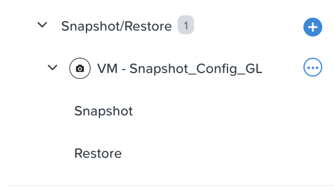
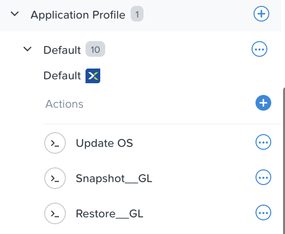
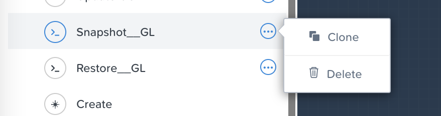

.. _phase6_optional:

---------------------------------------------------------------------
Lab optionnel : Installation du dashboard K8S
---------------------------------------------------------------------

Nous avons vu que le service embarqué Nutanix Karbon permet de livrer très facilement des clusters Kubernetes "production ready". 

La distribution utilisée par Karbon est dite **Certified Kubernetes** et donc certifiée par l'organisme CNCF en charge de Kubernetes au niveau global. 
Cela veut dire qu'aucun code utilisé dans Karbon n'est rendu propriétaire. 

Cela nous **offre une compatibilité native** avec un écosystème très large. Pour donner un exemple, vous pouvez retrouver sur le lien suivant le landscape CNCF : https://landscape.cncf.io/

Afin d'illustrer ces propos, nous allons installer le **dashboard Kubernetes**. 

Vous pouvez utiliser le dashboard pour déployer des applications conteneurisées, faire de la remédiation et manager les ressources d'un cluster. Le dashboard vous fournit une vue globale des applications déployées sur un cluster et vous permet de créer et/ou modifier les ressources (déploiement, jobs, deamonsets, etc). Vous pouvez par exemple demander un "scale" d'un déploiement, initier une mise à jour "rolling update", redémarer un pod, déployer de nouvelles applications, etc ... 

Déploiement du dashboard et ressources associées 
++++++++++++++++++++++++++++++++++++++++++++++++++++++++++++

#. L'installation du dashboard est simple à lancer, le manifest YAML est disponible sur GitHub. 

   - Taper la commande : ``kubectl apply -f https://raw.githubusercontent.com/kubernetes/dashboard/v2.4.0/aio/deploy/recommended.yaml``

   La liste des ressources créés va s'afficher : 

   .. image:: images/dash01.jpg
      :alt: dashboard

#. Utiliser k9s pour naviguer dans les ressources et découvrir le **Namespace** créé par le déploiement du manifest. 

   .. image:: images/dash02.png
      :alt: namespace 

#. Nous allons utiliser un service pour exposer le dashboard à l'extérieur du cluster. Créer un fichier dans le répertoire de l'utilisateur avec la commande ``cd + entrée`` suivi de ``vi svc-dashboard.yaml``

#. Copier le code suivant dans le fichier en utilisant la fonction **insert** de **vi**. 

   .. code-block:: yaml

      ---
      apiVersion: v1
      kind: Service
      metadata:
        name: kubernetes-dashboard-lb
        namespace: kubernetes-dashboard
      spec:
        type: LoadBalancer
        ports:
          - port: 443
            protocol: TCP
            targetPort: 8443
        selector:
          k8s-app: kubernetes-dashboard

#. Taper **ESC** puis ``:wq`` pour quitter et sauvegarde le fichier. 

#. Utiliser la commande kubectl pour déployer la ressource : ``kubectl apply -f svc-dashboard.yaml``

#. Dans k9s, un nouveau service avec une IP externe apparait. 

      .. image:: images/dash10.jpg
      :alt: dash 

#. Sur votre navigateur naviguer vers ``https://[IP DU LOADBALANCER]`` et utiliser la méthode d'authentification **Kubeconfig**. Pour cela retrouver votre fichier Kubeconfig et cliquer sur **Sign In**. 

   .. image:: images/dash03.jpg
      :alt: Dashboard UI  

#. Vous êtes ainsi connecté au Dashboard Officiel de Kubernetes. Parcourez les menus et comparer l'expérience avec k9s. 

   .. image:: images/dash04.jpg
      :alt: Dashboard UI 2  

---------------------------------------------------------------------
Lab optionnel : Sécuriser des opérations day 2 par snapshots
---------------------------------------------------------------------

Dans cette partie, nous allons voir comment sécuriser une VM avec un snapshot, lors des opérations à risque.

Configuration de l'environnement
++++++++++++++++++++++++++++++++

Afin de pouvoir utiliser les snapshots sous Calm, votre projet doit être configuré pour cela. Nous allons nous en charger : 

#. Cliquez sur l'icone ``Projects``

   .. image:: images/1.png
      :alt: Project
      :width: 40px

#. Cliquez ensuite sur le projet ``Bootcamp``
#. Cliquez maintenant sur l'onglet ``Policies`` en haut de la page
#. Et maintenant sur ``Snapshots`` dans le menu de gauche

   .. image:: images/2.png
      :alt: Snap menu
      :width: 600px

#. Dans la partie droite de fenêtre, vous avez soit une liste vide avec un bouton ``+ Create Snapshot Policy`` (si vous êtes le 1er à faire une politique de snaphsots), soit une liste de politiques de snapshots (si vous arrivez plus tard)
#. Cliquez sur 
   
   .. image:: images/3.png
      :alt: Create Snap
      :width: 150px

#. Il nous faut maintenant configurer notre politique de snapshots. Entrez les infos suivantes :
    
   - Policy Name : **[Vos initiales]-Snap**
   - Policy Description : Ce que vous voulez
   - Primary Site : Laissez **Default** et **NTNX_LOCAL_AZ** (il s'agit du cluster du lab)
   - Dans la partie ``Local snapshots``
   
     - Veillez à ce qu'il soit **Enable**
     - Modifiez la rétention au nombre de jours de votre choix
    
   - Dans la partie ``Remote snapshots``
       
     - Veillez à ce qu'il ne soit **pas** enable (nous n'avons pas de cluster distant sur ce lab)
    
   - Cliquez sur le bouton ``Save Snapshot Policy`` en bas à droite.

#. Si votre politique de snap **[Vos initiales]-Snap** est bien dans la liste, nous avons terminé avec cette partie.

Modification du blueprint
+++++++++++++++++++++++++

Maintenant que notre politique de snap est définie, nous allons l'utiliser dans notre projet.

Création de l'action de snap
----------------------------

#. Retournez dans la section Blueprints, et éditez votre blueprint **[Initiales]_DockerVM**
#. Développez le service ``DockerVM``
#. Vous devriez avoir un menu ``Snapshot/Restore`` disponible

   .. image:: images/4.png
      :alt: Snap menu
      :width: 250px

#. Cliquez sur le ``+`` pourt créer une action de snap ET de restore
#. Dans le popup qui s'affiche, renseignez les infos suivantes :
    
   - Snap/Restore suffix : **[Initiales]**
   - Snapshot name : laissez la valeur par défaut
   - Snapshot location : laissez ``local``
   - Replica options : laissez ``Take Snapshot of the first replica only``
   - Delete older VM after restore : **Cochez cette case**

#. Validez avec le bouton ``Save``

Votre configuration de snapshot se trouve maintenant visible dans l'entrée ``Snapshot/Restore`` du service

Si vous cliquez dessus, vous aurez les détails de configuration que vous pourrez modifier si vous le souhaitez

.. image:: images/6.png
   :alt: Snap menu
   :width: 250px

Vous constaterez aussi que l'application (dans la partie ``Àpplication profile`` plus bas) diospose dorénavant de 2 actions supplémentaires correspondant au snpashot et à sa restauration

Utilisation dans une action élaborée
------------------------------------

Notre objectif est de sécuriser des opérations "risquées" qu'on pourrait faire sur notre application, pas simplement d'avoir une action dédiée aux snapshots et aux restaurations.

Suppression/modification des actions par défaut
===============================================

Nous allons débuter par : 
   
- Supprimer l'action de snapshot créée par défaut, car elle est peu utile seule.
- Renommer l'action de restauration pour la rendre plus compréhensible pour l'utilisateur qui managera l'application

Pour la suppression de l'action de snapshot, cliquez sur le rond à droite de cette dernière, et va s'afficher un menu d'actions contextuelles. Choisissez ``Delete``. Votre action disparaîtra immédiatement. 

Cliquez ensuite sur l'action ``Restore_[Initiales]`` et dans la partie droite de l'éditeur, renommez la **Restauration Snapshot**

Sauvegardez votre blueprint.

Modification de notre action Update OS
======================================

L'idéal est d'intégrer la prise de snapshot dans l'action même qui va réaliser une opération "à risque". Ainsi, pas de risque d'oubli de la sécurisation par exemple.

Nous allons sécuriser par snapshot l'action ``update OS`` créée plus tôt.

#. Cliquez sur l'action ``Update OS``. 
#. Au centre, s'affiche le workflow (simpliste)

   .. image:: images/9.png
      :alt: Update OS before
      :width: 250px

#. Cliquez sur le ``+ Action`` (du bas), et dans le panneau de droite, sélectionnez 
   
   .. image:: images/10.png
      :alt: Snapshot action
      :width: 300px

#. Votre action Update OS ressemble maintenant à ça :
    .. image:: images/11.png
       :alt: Update OS Temporary
       :width: 300px

#. Si on regarde le sens de la flêche, on constate que l'update se fait avant le snapshot, ce qui est un non sens. On va donc les inverser :
  
   #. Cliquez sur la flêche
   #. Cliquez sur l'icône "poubelle" qui vient d'apparaître, ça va supprimer la flêche
   #. Cliquez maintenant sur l'action de snapshot (en bas)
   #. Cliquez sur l'icône flêche qui vient d'apparaître sur la droite
          
      .. image:: images/12.png
         :alt: Dependancy icon
         :width: 300px

   #. Cliquez sur la tâche ``Update`` en haut
   #. Les tâches sont maintenant bien ordonnancées
      
      .. image:: images/13.png
         :alt: Update os Final
         :width: 300px

   #. Sauvegardez votre blueprint

Bravo, vous venez de sécuriser une opération à risque disponible sur votre blueprint. Les consommateurs de cette application n'auront donc plus de soucis à se faire, ils auront des snapshots récents automatisés, et sauront réaliser des retours arrière eux-même.

.. image:: images/secure.gif
   :alt: Very very secure
   :width: 300px

Tester les snapshots 
++++++++++++++++++++

Si vous voulez tester cette fonctionnalité de snapshots, il faut redéployer votre VM Docker depuis ce nouveau blueprint, puis utiliser les actions ``Update OS`` et enfin ``Restore Snapshot``